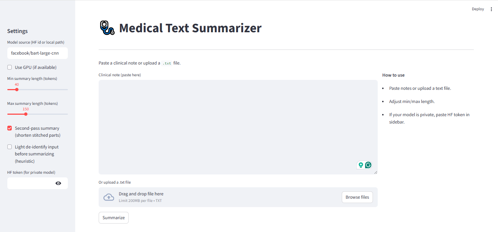

# Medical Text Summarizer 🏥📝

## 📌 Project Overview



The **Medical Text Summarizer** is an NLP-based project that takes long clinical notes or discharge summaries and generates concise, readable summaries.
This helps doctors, nurses, and patients quickly understand key medical information.

---

## Quick demo
- Paste a clinical note and click **Summarize**.  
- Example input → output screenshot:  


---

## 🎯 Goal

* Build an AI tool that summarizes medical texts into short, human-friendly formats.
* Provide multilingual summarization for patient understanding.
* Deploy as a simple **web app** (Streamlit/Flask).

---

## ⚙️ Tech Stack

* **Python** (3.10)
* **NLP & Transformers** → Fine-tuned `facebook/bart-large-cnn`, T5, scispaCy
* **Dataset** → (Hugging Face `ccdv/pubmed-summarization`)
* **Frontend** → Streamlit / Flask
* **Version Control** → Git & GitHub

---

## 🚀 Setup Instructions

### 1️⃣ Clone the Repository

```bash
git clone https://github.com/Naeem1504/Medical-Text-Summarizer.git
cd Medical-Text-Summarizer
```

### 2️⃣ Create & Activate Environment

```bash
conda create --name medtext python=3.10 -y
conda activate medtext
```

### 3️⃣ Install Dependencies

```bash
pip install -r requirements.txt
```

---

## 📂 Project Structure

```
Medical-Text-Summarizer/
│
├── data/               # Datasets (not pushed to GitHub)
│   └── README.md        # Notes about dataset usage
│
├── notebooks/          # Jupyter notebooks for experiments
│
├── src/                # Source code for the summarizer
│
├── app.py              # Streamlit/Flask app entry point
│
├── requirements.txt    # Project dependencies
│
└── README.md           # Project documentation
```

---

## ✨ Features

* Summarizes **long medical texts** into short summaries
* **Multilingual summarization** for patients
* User-friendly **web interface**
* Optimized for **healthcare use cases**

---

## 📖 Dataset

This project uses PubMed / clinical notes (training & evaluation)
You can use **MIMIC-III clinical notes** (restricted access).
👉 You must request access via [PhysioNet](https://physionet.org/content/mimiciii/1.4/) to use this dataset.

---

## 🤝 Contribution

Pull requests are welcome!

* Fork the repo
* Create a new branch
* Commit changes
* Open a Pull Request

---

## 📜 License

This project is licensed under the **MIT License**.

---

## How to run locally
```bash
git clone https://github.com/<Naeem1504>/Medical-Text-Summarizer.git
cd Medical-Text-Summarizer
conda activate medtext
pip install -r requirements.txt
# set env var to your model on HF (optional)
export MODEL_SOURCE="Naeem92/medtext-bart-finetuned"   # macOS/Linux
setx MODEL_SOURCE "Naeem92/medtext-bart-finetuned"     # Windows (restart terminal)
python -m streamlit run app.py